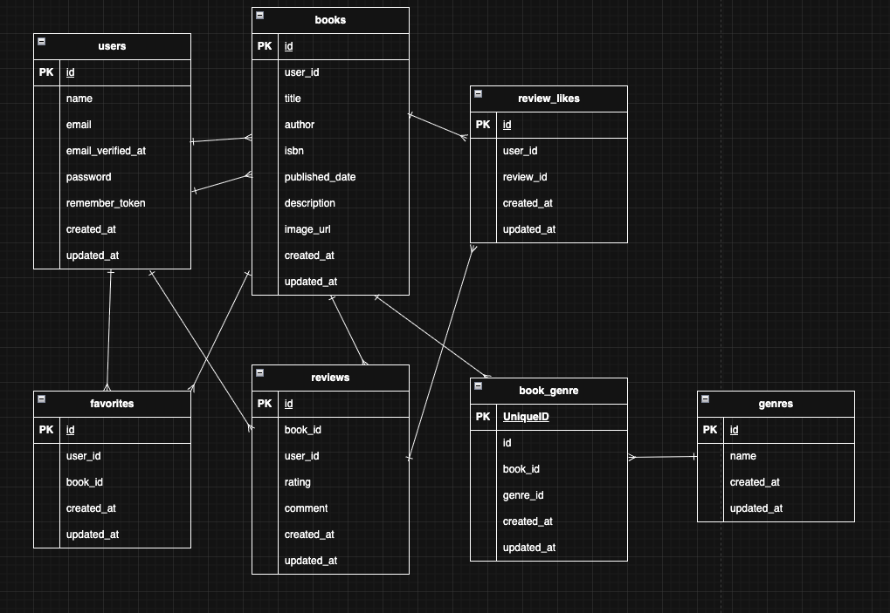

# BookShelf 書籍レビューアプリ

## プロジェクトの目的

実務を想定したWebアプリケーション開発と、曖昧な要件から自ら仕様を設計しPMと詳細を詰めるプロセスを経験すること

## アプリ概要

本アプリは、書籍レビューアプリケーション「BookShelf」です。
ユーザーは書籍を登録・閲覧し、レビューの投稿やお気に入り登録ができます。
ジャンルによる分類やレビューへのいいね機能、平均評価に基づくランキング機能も備えています。
外部アプリケーション向けの公開API（JSON）も提供します。

## ER図

## 環境構築

### Dockerビルド

・

## Laravel環境構築

・

## 開発環境

・

## 使用技術

## 作成者

舘岡藍加

## APIエンドポイント一覧

## 開発環境URL
・書籍一覧（トップ）：http://localhost/  
・書籍詳細：http://localhost/books/{book}  
・書籍登録：http://localhost/books/create  
・書籍編集：http://localhost/books/{book}/edit  
・ジャンル一覧：http://localhost/genres  
・ジャンル詳細：http://localhost/genres/{genre}  
・ジャンル登録：http://localhost/genres/create  
・ジャンル編集：http://localhost/genres/{genre}/edit  
・レビュー編集：http://localhost/reviews/{review}/edit  
・お気に入り一覧：http://localhost/favorites  
・ランキング：http://localhost/ranking  
・ログイン：http://localhost/login  
・会員登録：http://localhost/register  
・phpMyAdmin：http://localhost:8080  